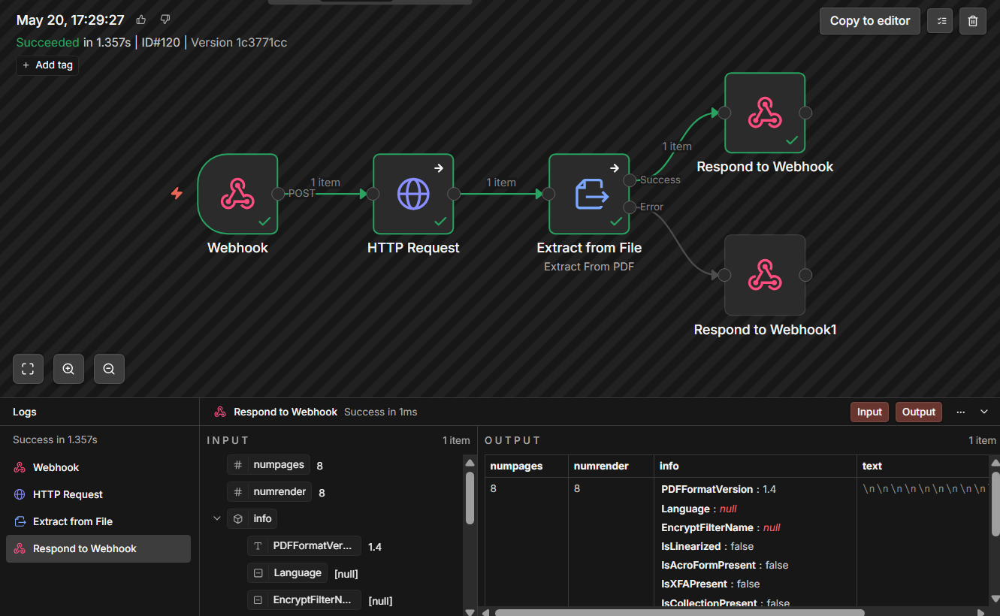

# 📊 Techno Screen - PDF Manager & n8n Automation

[](https://react.dev/)
[](https://nodejs.org/)
[](https://www.typescriptlang.org/)
[](https://supabase.com/)
[](https://n8n.io/)
[](https://expressjs.com/)

**Techno Screen PDF Manager** es una plataforma web integral diseñada para simplificar y automatizar el flujo de trabajo de procesamiento de órdenes técnicas y documentos PDF. La plataforma permite la gestión segura de cargas, previsualización interactiva de alta definición, almacenamiento persistente en la nube e integración síncrona bidireccional en tiempo real con workflows de **n8n**.

---

## 🚀 Características Destacadas

*   **🔒 Autenticación y Control de Roles:** Registro y Login protegidos por JSON Web Tokens (JWT). Diferenciación estricta de roles entre **Administradores** (aceso a todo el historial, eliminación de órdenes) y **Usuarios Estándar** (visualización y carga de órdenes personales asociadas a plantillas específicas).
*   **📂 Módulo de Carga Drag & Drop:** Zona interactiva de arrastrar y soltar archivos PDF técnicos con validaciones en tiempo real de tamaño, tipo y formato de archivo.
*   **👁️ Revisión Técnica Integrada (Visor HD):** Sistema de visualización de PDFs embebido en modal de pantalla completa para auditoría de legibilidad técnica antes del envío definitivo.
*   **☁️ Almacenamiento e Infraestructura en la Nube (Supabase):** 
    *   Subida automatizada de binarios PDF al bucket privado `pdfs` en **Supabase Storage**.
    *   Registro relacional completo de órdenes y enlaces públicos persistentes de documentos en la tabla `orders` de **Supabase Database**.
*   **🔄 Integración Síncrona en Vivo con n8n:** 
    *   Comunicación síncrona en tiempo real mediante HTTP Webhooks (Axios) con un tiempo de espera de hasta 30 segundos.
    *   **Protección anti-vacíos:** Detección de respuestas inválidas o vacías (`""`) y mapeo directo de estatus de red RESTful (`HTTP 201` para éxito y `HTTP 400` para errores lógicos de validación en n8n).
    *   **Visualización Dinámica de Errores:** Visualización directa y en tiempo real en la pantalla de React de los mensajes lógicos de éxito o rechazo generados en vivo por el motor de n8n (ej. *"Error crítico: El archivo PDF está corrupto o no se pudo abrir."*).

---

## 🗺️ Flujo de Trabajo y Arquitectura (Modo Producción)

El siguiente diagrama detalla cómo interactúan síncronamente el Frontend, el Backend de Node.js, los servicios en la nube de Supabase y el workflow en n8n ante cada carga de archivo:

```mermaid
sequenceDiagram
    autonumber
    actor Usuario
    participant Frontend as React App (Vite)
    participant Backend as Node.js API (Express)
    participant Storage as Supabase Storage
    participant DB as Supabase SQL DB
    participant n8n as n8n Webhook

    Usuario->>Frontend: Selecciona & Sube PDF Técnico
    Frontend->>Backend: POST /api/orders/upload (FormData)
    
    Backend->>Storage: Sube binario PDF (bucket 'pdfs')
    Storage-->>Backend: Confirma subida & Retorna metadatos
    Note over Backend: Obtiene URL pública del PDF en Storage
    
    Backend->>DB: Inserta registro de orden (order_id, user_id, filename, pdf_url)
    DB-->>Backend: Confirma inserción exitosa de la orden
    
    rect rgb(28, 33, 41)
        Note over Backend, n8n: Conexión Síncrona Activa (Timeout 30s)
        Backend->>n8n: POST [N8N_WEBHOOK_URL] con JSON Payload (URL Real)
        Note over n8n: n8n procesa, descarga y valida el PDF real
        n8n-->>Backend: Retorna JSON de Respuesta (Éxito o Error de Negocio)
    end
    
    Note over Backend: Valida robustamente el JSON devuelto
    Note over Backend: Limpia el mensaje lógico (remueve prefijos)
    Backend-->>Frontend: Retorna success: true/false + HTTP 201 (Éxito) o HTTP 400 (Fallo)
    Note over Frontend: Axios detecta HTTP 400 y salta al catch block en caso de fallo
    Frontend-->>Usuario: Muestra en pantalla el mensaje de éxito de n8n o la alerta roja de error
```



---

## 🛠️ Requisitos Previos

Antes de desplegar e iniciar la aplicación localmente, asegúrate de tener:
- [Node.js](https://nodejs.org/) (Versión 18 o superior recomendada)
- [Git](https://git-scm.com/) instalado en el sistema
- Una base de datos PostgreSQL activa y configurada en [Supabase](https://supabase.com/)
- Una instancia o cuenta activa de [n8n](https://n8n.io/)

---

## ⚙️ Configuración de Variables de Entorno

Configura el archivo `.env` en la raíz de la carpeta del backend (`/api/.env`) con tus credenciales:

```env
PORT=3000

# Credenciales de Conexión a Supabase
SUPABASE_URL=https://tu-proyecto.supabase.co
SUPABASE_KEY=tu-supabase-service-role-key-secreta

# Secreto para firma y validación de tokens JWT
JWT_SECRET=tu_secreto_super_seguro_y_largo

# Configuración de Integración con n8n
N8N_WEBHOOK_URL=https://tu-instancia-n8n.com/webhook/tu-ruta-de-webhook
N8N_API_KEY=tu_clave_api_para_n8n
```

---

## 📦 Guía de Instalación e Inicio Rápido

Sigue estos sencillos pasos para iniciar ambos entornos en tu equipo de desarrollo local:

### 1. Clonar el Repositorio
```bash
git clone https://github.com/wlopera/WebTechnoScreen.git
cd WebTechnoScreen
```

### 2. Levantar el Backend API (`/api`)
```bash
cd api
npm install
# Crea y edita tu archivo .env basado en la sección anterior
npm run dev
```

### 3. Levantar el Frontend Web (`/web`)
Abre otra terminal en la raíz del proyecto y ejecuta:
```bash
cd web
npm install
npm run dev
```
Abre en tu navegador la dirección local que te indique Vite (usualmente `http://localhost:5173`).

---

## 🗄️ Inicialización de Base de Datos y Storage

Para disponer de todas las relaciones y tablas requeridas:
1. Copia el contenido del archivo `database.sql` y ejecútalo directamente en el **SQL Editor** de tu panel de control de Supabase. Esto creará las tablas `users` y `orders` con sus campos correspondientes.
2. En tu panel de Supabase, entra a la pestaña de **Storage** y crea un nuevo Bucket público llamado `pdfs`.
3. Configura las siguientes políticas de seguridad **RLS (Row Level Security)** en el bucket `pdfs` para permitir que el backend manipule archivos:
    * **Insert:** Permitir subida si el rol es válido.
    * **Select:** Permitir lectura/descarga pública.

---

## 🔒 Estándares de Seguridad e Integración con n8n

*   **Header Auth:** La comunicación entre el backend y n8n viaja cifrada y autenticada opcionalmente adjuntando la cabecera `X-API-KEY` in las peticiones.
*   **Estatus HTTP RESTful:** El backend mapea de forma nativa los errores internos de validación de negocio de n8n retornando estatus HTTP `400 Bad Request` en lugar de `200/201`. Esto le permite al cliente Axios en React interceptar limpiamente los problemas en su sección `catch` de inmediato.

---

## 🤖 Flujo de Automatización en n8n

El flujo de trabajo implementado en **n8n** se encarga de recibir la orden, descargar el archivo de Supabase y validar de manera síncrona el contenido del PDF para responderle a Node.js en tiempo real:



### Explicación de los Nodos del Workflow:
1.  **Webhook (POST):** Recibe el payload en tiempo real con el `orderId` y la `pdfUrl` generada en Supabase.
2.  **HTTP Request (GET):** Descarga el archivo binario del PDF directamente desde la URL de Supabase Storage.
3.  **Extract from File (PDF Parser):** Realiza la lectura técnica y parsing del contenido del archivo cargado.
4.  **Respond to Webhook (síncrono):**
    *   **Respond to Webhook (Éxito):** Retorna `success: true` indicando que el PDF fue leído con éxito y mapea la información.
    *   **Respond to Webhook1 (Error):** En caso de fallo o archivo corrupto, retorna `success: false` y el mensaje de error lógico.
